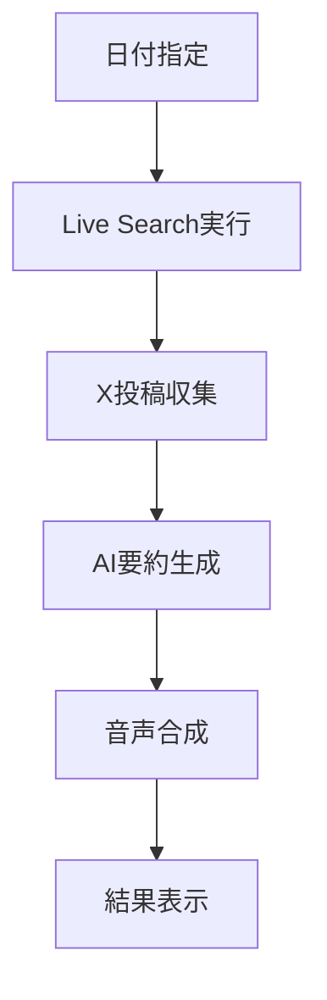

# 🎙️ Hot Topic Radio

開発者向けのホットトピックを自動収集し、音声で配信するWebアプリケーションです。X（旧Twitter）から最新の開発関連トピックを収集し、AIが要約してテキスト読み上げ機能で配信します。

## 📋 概要

Hot Topic Radioは、忙しい開発者が最新の技術トレンドやニュースを効率的にキャッチアップできるよう設計されたアプリケーションです。

### 主な機能

- **🔍 リアルタイム検索**: XAI APIのLive Search機能を使用してXから最新の開発関連投稿を収集
- **🤖 AI要約**: Grok-4-fastモデルを使用して投稿内容を日本語で要約
- **🎵 音声合成**: Google Cloud Text-to-Speech APIで日本語音声を生成
- **📅 日付指定**: 特定の日付のトピックを検索可能
- **📱 レスポンシブUI**: モダンなWebインターフェース

## 🏗️ アーキテクチャ

### 技術スタック

- **フロントエンド**: Next.js 15.5.4 + React 19 + TypeScript + Tailwind CSS
- **バックエンド**: Next.js API Routes + Mastra Framework
- **AI/ML**: XAI Grok-4-fast + Google Cloud Text-to-Speech
- **データベース**: LibSQL (メモリストレージ)
- **デプロイ**: Vercel対応

### システム構成

```
┌─────────────────┐    ┌──────────────────┐    ┌─────────────────┐
│   フロントエンド   │────│   Next.js API    │────│   Mastra Core   │
│   (React/TS)    │    │   (Workflow)     │    │   (Agents)      │
└─────────────────┘    └──────────────────┘    └─────────────────┘
                                │                        │
                                ▼                        ▼
                       ┌──────────────────┐    ┌─────────────────┐
                       │  ストリーミング   │    │  Live Search    │
                       │  レスポンス       │    │  + TTS Tools    │
                       └──────────────────┘    └─────────────────┘
```

## 🚀 セットアップ

### 前提条件

- Node.js 18以上
- npm または yarn
- XAI API キー
- Google Cloud Text-to-Speech API キー

### 環境変数の設定

`.env.local`ファイルを作成し、以下の環境変数を設定してください：

```bash
# XAI API設定
XAI_API_KEY=your_xai_api_key_here

# Google Cloud Text-to-Speech API設定
GOOGLE_APPLICATION_CREDENTIALS=path/to/your/service-account-key.json
# または
GOOGLE_CLOUD_PROJECT=your_project_id
GOOGLE_CLOUD_KEY_FILE=path/to/key.json
```

### インストール手順

1. **リポジトリのクローン**
   ```bash
   git clone <repository-url>
   cd hot-topic-radio
   ```

2. **依存関係のインストール**
   ```bash
   npm install
   ```

3. **環境変数の設定**
   ```bash
   cp .env.example .env.local
   # .env.localを編集してAPIキーを設定
   ```

4. **開発サーバーの起動**
   ```bash
   npm run dev
   ```

5. **ブラウザでアクセス**
   ```
   http://localhost:3000
   ```

## 🎯 使用方法

### 基本的な使い方

1. **日付選択**: 対象日付を選択（デフォルトは今日）
2. **実行**: 「ワークフローを実行」ボタンをクリック
3. **結果確認**: 
   - リアルタイムでステータスが更新される
   - テキスト要約が表示される
   - 音声ファイルが生成される
4. **音声再生**: 生成された音声を再生

### ワークフローの流れ



## 🔧 開発

### プロジェクト構造

```
hot-topic-radio/
├── app/                    # Next.js App Router
│   ├── api/workflow/      # ワークフローAPI
│   ├── page.tsx           # メインページ
│   └── layout.tsx         # レイアウト
├── src/mastra/            # Mastraフレームワーク
│   ├── agents/            # AIエージェント
│   ├── tools/             # カスタムツール
│   ├── workflows/         # ワークフロー定義
│   └── index.ts           # Mastra設定
├── package.json           # 依存関係
└── README.md             # このファイル
```

### 主要コンポーネント

#### 1. Developer Hot Topic Agent
- **場所**: `src/mastra/agents/developer-hot-topic-agent.ts`
- **役割**: X投稿の検索・要約を行うAIエージェント
- **特徴**: 
  - 日本語での要約生成
  - 300文字以内の簡潔な要約
  - 音声読み上げに最適化された文章

#### 2. Live Search Tool
- **場所**: `src/mastra/tools/live-search-tool.ts`
- **役割**: XAI APIを使用してXから投稿を検索
- **機能**:
  - 日付範囲指定
  - 人気度フィルタリング（いいね数・閲覧数）
  - 技術キーワード検索

#### 3. TTS Tool
- **場所**: `src/mastra/tools/tts-tool.ts`
- **役割**: Google Cloud Text-to-Speechで音声生成
- **設定**: 日本語音声

#### 4. Workflow
- **場所**: `src/mastra/workflows/developer-hot-topic-workflow.ts`
- **フロー**: 
  1. `generate-hot-topic`: トピック生成
  2. `tts`: 音声合成

### 開発コマンド

```bash
# 開発サーバー起動
npm run dev

# ビルド
npm run build

# 本番サーバー起動
npm start

# リンター実行
npm run lint

# リンター自動修正
npm run lint:fix
```

### デバッグ

- ブラウザの開発者ツールでコンソールログを確認
- ワークフローの実行状況はリアルタイムで表示
- APIエラーはステータスメッセージに表示

## 🚀 デプロイ

### Vercelデプロイ

1. **Vercelアカウント作成・ログイン**
   ```bash
   npm install -g vercel
   vercel login
   ```

2. **環境変数設定**
   - Vercelダッシュボードで環境変数を設定
   - または`vercel env`コマンドを使用

3. **デプロイ実行**
   ```bash
   vercel --prod
   ```

### 環境変数（本番環境）

Vercelの環境変数設定で以下を追加：

```
XAI_API_KEY=your_production_xai_api_key
GOOGLE_APPLICATION_CREDENTIALS=your_google_credentials_json
```


## 🔒 セキュリティ

- APIキーは環境変数で管理
- フロントエンドにAPIキーを露出しない
- CORS設定の適切な管理
- レート制限の実装推奨

## 🐛 トラブルシューティング

### よくある問題

1. **XAI APIエラー**
   - APIキーが正しく設定されているか確認
   - レート制限に達していないか確認

2. **Google TTS エラー**
   - 認証情報が正しく設定されているか確認
   - APIが有効化されているか確認

3. **音声再生できない**
   - ブラウザの音声ポリシーを確認
   - HTTPSでアクセスしているか確認

### ログ確認

```bash
# 開発環境でのログ確認
npm run dev
# ブラウザのコンソールとターミナルの両方を確認
```

## 🤝 コントリビューション

1. Forkしてブランチを作成
2. 機能追加・バグ修正を実装
3. テストを追加・実行
4. Pull Requestを作成

### 開発ガイドライン

- TypeScriptの型安全性を保つ
- ESLintルールに従う
- コミットメッセージは日本語OK
- 機能追加時はREADMEも更新

## 📄 ライセンス

このプロジェクトはMITライセンスの下で公開されています。

## 🙋‍♂️ サポート

問題や質問がある場合は、GitHubのIssuesで報告してください。

---

**Powered by Next.js + Mastra + XAI + Google Cloud**